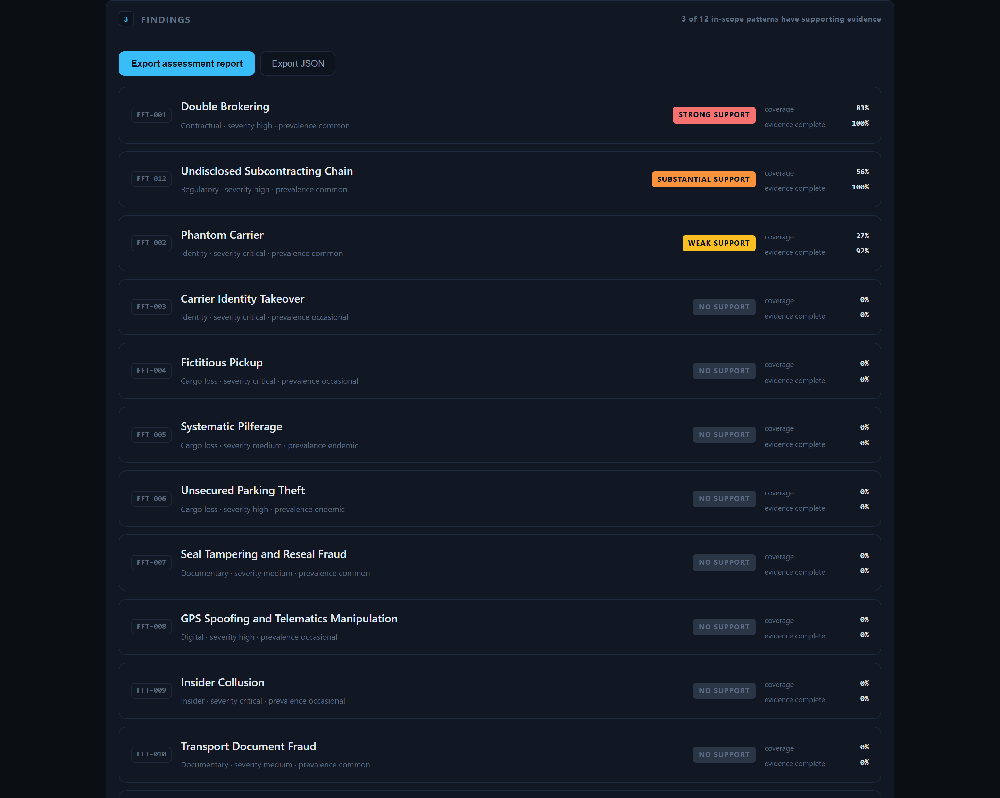
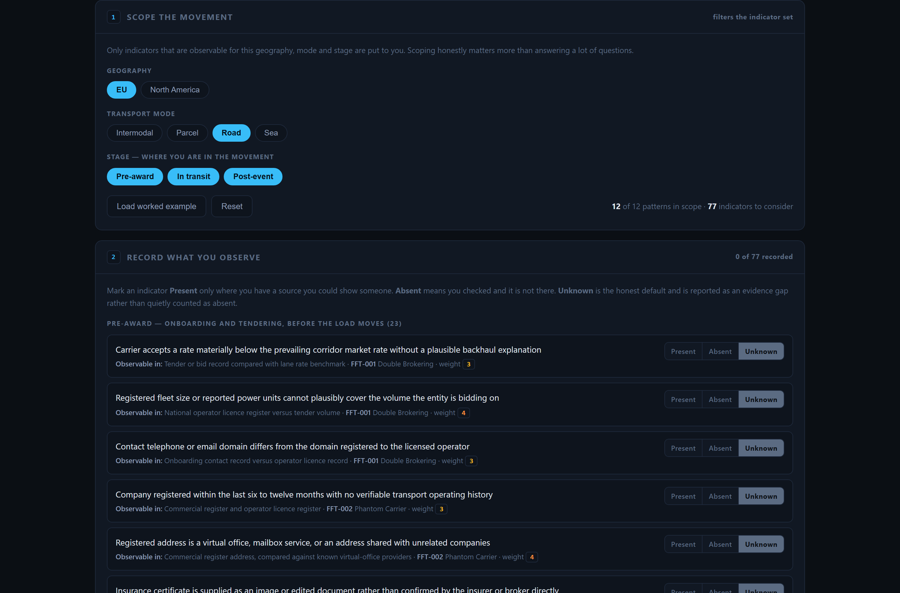
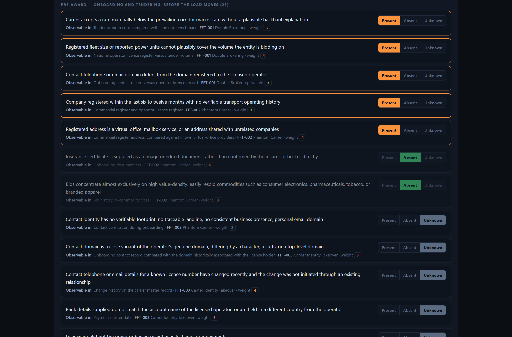
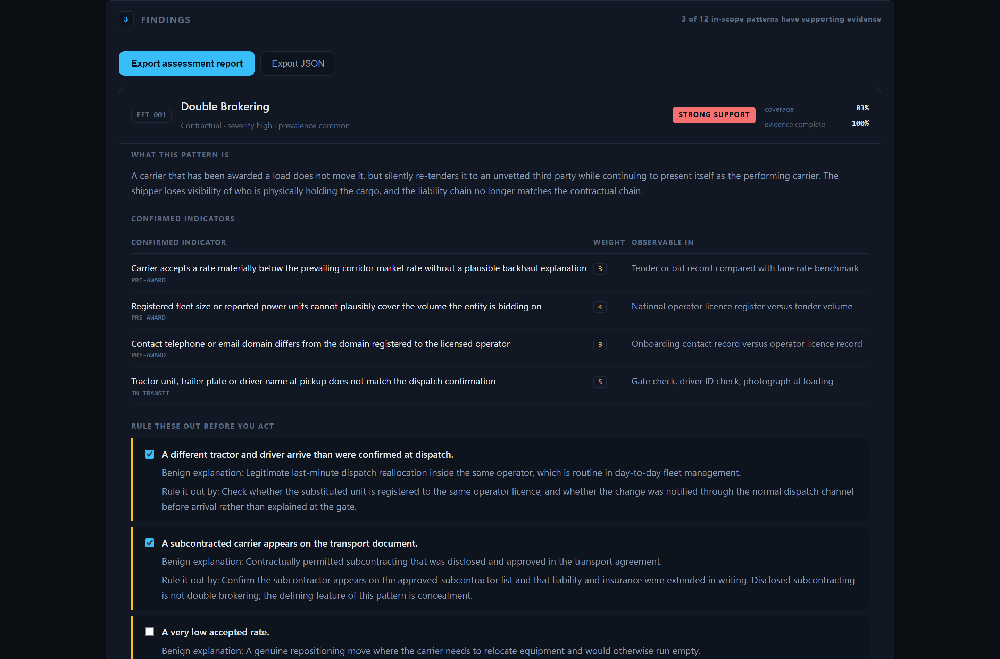
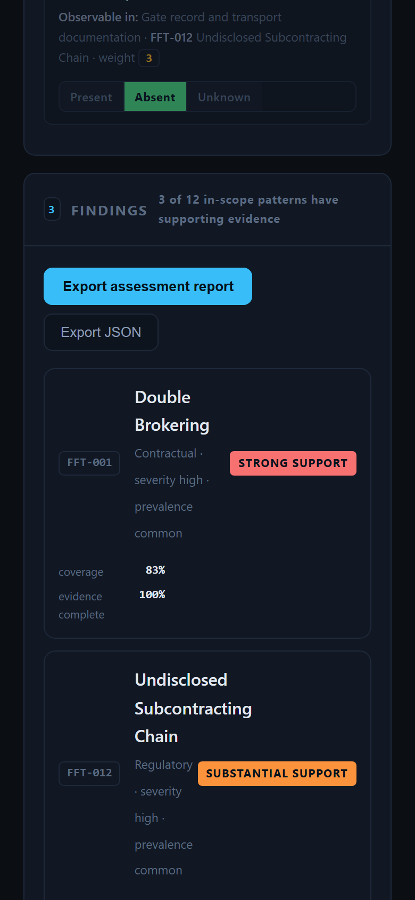

# Freight Risk Atlas

An open assessment engine for freight and carrier fraud risk. You scope a movement, record what you
can actually observe about the carrier or the lane, and it tells you which fraud patterns the
evidence supports — together with the false positives you have to rule out first, the countermeasures
that apply at that stage, and the regulatory duties the finding engages.

**Live tool: https://jeevan-0508.github.io/freight-risk-atlas/**

It runs entirely in the browser. Nothing you type is transmitted, logged or stored.



## What problem this solves

Fraud indicator lists are easy to find. What they do not tell you is which combination of indicators
justifies acting on a carrier, which benign explanation produces the same signal, or what you are
entitled to do about it once you are confident. Investigators end up carrying that judgement in their
heads, which makes assessments inconsistent between people and hard to defend afterwards.

The Atlas makes that judgement explicit and reproducible. Two people working the same carrier with
the same evidence get the same finding, and the finding comes with its own audit trail.

## What it deliberately does not do

**It does not estimate a probability of fraud.** It reports *indicator coverage*: the share of a
pattern's in-scope indicator weight that you have confirmed present. A carrier at 83% coverage for
double brokering is not "83% likely to be a double broker" — it means the evidence you hold matches
most of what that pattern looks like, and the case warrants investigation.

This distinction is the whole point. A tool that emitted a fraud probability from a checklist would
be inventing precision it does not have, and any risk decision built on it would be indefensible the
first time a carrier challenged it.

Three further honest limits:

- **Unknown is not Absent.** Unanswered indicators are reported as evidence gaps with their weight,
  never silently counted as clean. Every finding therefore carries an evidence-completeness figure
  alongside its coverage, so a confident-looking score built on 30% of the evidence is visibly weak.
- **Coverage says nothing about causation.** High coverage on a pattern with a plausible benign
  explanation is not a finding until the false-positive gates are cleared. The tool blocks nothing —
  it simply refuses to let you forget them.
- **No incident data.** The Atlas contains no loss figures, no corridor statistics and no carrier
  data. It reasons purely over the open taxonomy. Anything numeric you see is derived from the
  indicator weights, and every weight is traceable to a public source.

## How the assessment works

**1. Scope the movement.** Geography, transport mode and stage. Only patterns that apply to that
geography and mode are assessed, and only indicators observable at the selected stages are put to
you. Scoping honestly matters more than answering a lot of questions.



**2. Record what you observe.** Each in-scope indicator is presented with the evidence source it is
observable in, the pattern it belongs to, and its weight. Mark it Present, Absent or leave it Unknown.



**3. Read the findings.** For every in-scope pattern:

```
coverage     = (weight of indicators confirmed Present) / (weight of all in-scope indicators)
completeness = (weight of indicators answered Present or Absent) / (weight of all in-scope indicators)
```

Coverage is banded as No / Weak / Substantial / Strong support at 0 / 15 / 35 / 60 percent. The bands
are a reading aid, not a threshold for action — the false-positive gates are.



Countermeasures are filtered to the stages you selected, because advice you can no longer act on is
noise: preventive measures for pre-award, detective for in-transit, responsive for post-event.

**4. Export.** Markdown for the case file, JSON for a pipeline. Both record the scope, the risk-model
version, the confirmed indicators with their evidence sources, the outstanding gaps, the
false-positive checklist and its state, and the regulatory hooks engaged.

## Risk model and provenance

The Atlas has no risk logic of its own. Patterns, indicators, weights, false positives,
countermeasures and regulatory hooks all come from the
**[Freight & Carrier Fraud Risk Taxonomy](https://github.com/Jeevan-0508/freight-fraud-taxonomy)**
(12 patterns, 77 indicators, 137 countermeasures, CC BY 4.0), which is compiled from public
industry, law-enforcement and regulatory sources.

A copy lives in this repository at `data/taxonomy.json` so the site never depends on a cross-origin
fetch at page load. `scripts/sync_taxonomy.py` refreshes it and **refuses to write** a model that
fails its structural checks — unknown indicator phase, weight outside 1–5, missing evidence source,
or an empty countermeasure category. A weekly GitHub Action runs the sync and commits only when the
upstream model has actually changed.

```bash
python scripts/sync_taxonomy.py                 # pull from upstream and validate
python scripts/sync_taxonomy.py data/taxonomy.json   # validate the local copy only
```

## Running it locally

No build step and no dependencies. The page fetches `taxonomy.json`, so it needs to be served over
HTTP rather than opened from disk:

```bash
python -m http.server 8000 --directory docs
# then open http://localhost:8000
```

## Verification

The site is tested against the real rendered DOM in headless Chrome rather than against its own
source, including an independent recomputation of the coverage arithmetic from `taxonomy.json` and a
check that the exported report contains no `undefined` or `NaN`.

| Suite | Assertions |
| --- | --- |
| Model loading, scope controls, observation rows, live re-ranking | 20 |
| Worked example, findings detail, gates, stage filtering, reset | 21 |
| Markdown and JSON export, coverage arithmetic, scope integrity | 24 |
| Mobile layout and overflow at 360 / 390 / 412 px | 7 × 3 |

The same three-step flow at 390 px, with no horizontal overflow at any tested width:



All pass. CI additionally validates the risk model, confirms `docs/taxonomy.json` matches
`data/taxonomy.json`, and parses the application.

## Licence

Code: MIT. Risk model: CC BY 4.0, from the Freight & Carrier Fraud Risk Taxonomy.

Provided for risk-assessment purposes. It is not legal advice, it does not determine whether fraud
has occurred, and it contains no confidential or employer-specific material.
